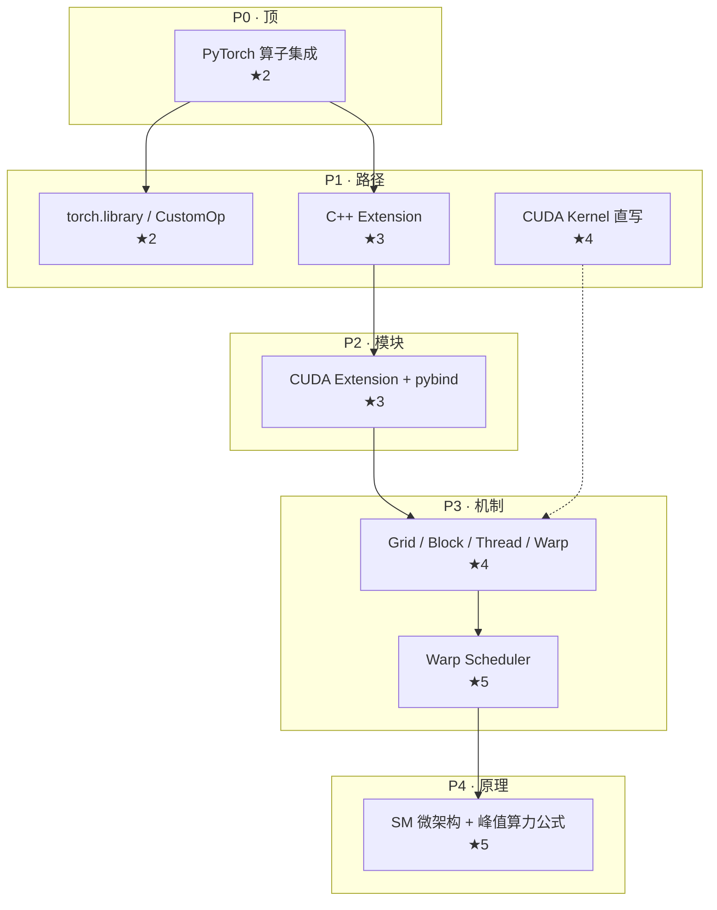

# Reference · 金字塔知识图谱

## Mermaid 模板



**样式约定**

- subgraph 标题 = 层代号 + 层名
- 节点：`名称<br/>★难度`
- 主链：`-->`
- 未核实 / 可选：`-.->`

---

## HTML 金字塔

生成单文件 HTML，保存后浏览器打开即可；结构：顶窄底宽，每层一行卡片，主链高亮。

```html
<!DOCTYPE html>
<html lang="zh-CN">
<head>
  <meta charset="UTF-8" />
  <title>金字塔 · {主题}</title>
  <style>
    * { box-sizing: border-box; margin: 0; padding: 0; }
    body { font-family: system-ui, sans-serif; background: #0f1419; color: #e6edf3; padding: 24px; }
    h1 { text-align: center; font-size: 1.25rem; margin-bottom: 8px; }
    .meta { text-align: center; color: #8b949e; font-size: 0.85rem; margin-bottom: 24px; }
    .pyramid { display: flex; flex-direction: column; align-items: center; gap: 12px; }
    .tier { display: flex; flex-wrap: wrap; justify-content: center; gap: 8px; width: 100%; }
    .tier-label { width: 100%; text-align: center; font-size: 0.75rem; color: #58a6ff; letter-spacing: 0.05em; }
    .node {
      background: #161b22; border: 1px solid #30363d; border-radius: 8px;
      padding: 10px 14px; max-width: 220px; font-size: 0.8rem; line-height: 1.4;
    }
    .node.main { border-color: #238636; box-shadow: 0 0 0 1px #238636; }
    .node .d { color: #8b949e; font-size: 0.7rem; }
    .node .stars { color: #d29922; }
    .chain { margin-top: 32px; padding: 16px; background: #161b22; border-radius: 8px; font-size: 0.85rem; line-height: 1.6; }
  </style>
</head>
<body>
  <h1>金字塔知识图谱 · {主题}</h1>
  <p class="meta">顶层命题：{…} · 依据：{官方文档列表}</p>
  <div class="pyramid">
    <!-- 每层复制 .tier；P0 1 个节点，P1 多个，逐层变宽 -->
    <div class="tier">
      <div class="tier-label">P0 · 顶</div>
      <div class="node main"><strong>{名称}</strong><br/><span class="d">{定义}</span><br/><span class="stars">★★</span></div>
    </div>
    <!-- P1…P4 -->
  </div>
  <div class="chain"><strong>主链：</strong> N0 → N1 → … → N4</div>
</body>
</html>
```

填充规则：按层填入全部 **verified** 节点；主链节点加 `main` class。

---

## PyTorch 算子 → CUDA 原理：样例骨架

> 完整展开须检索 PyTorch 2.x docs + CUDA C Programming Guide + 目标 GPU Whitepaper。**此处为结构示范，具体数字运行时核实。**

| id | 层 | 名称 | 难度 | 向下理由 |
|----|----|------|------|----------|
| N0 | P0 | PyTorch 自定义算子集成 | 2 | 用户问「如何集成」 |
| N1a | P1 | `torch.library` / CustomOpBase | 2 | 官方推荐注册路径（2.4+） |
| N1b | P1 | C++/CUDA Extension (pybind11) | 3 | 经典扩展路径 |
| N1c | P1 | 仅 Python + composite implicit autograd | 2 | 无 kernel 的复合算子 |
| N2 | P2 | CUDA Kernel 源文件 + 构建 (setup.py / CMake) | 3 | 路径 N1b 的实现载体 |
| N3 | P2 | ATen dispatch / DeviceGuard | 4 | Tensor 设备与类型分发 |
| N4 | P3 | SIMT 执行模型 | 4 | GPU kernel 如何映射线程 |
| N5 | P3 | Grid → Block → Thread → Warp (32) | 4 | CUDA 线程层次 |
| N6 | P3 | Warp Scheduler / 指令发射 | 5 | SM 内调度 |
| N7 | P3 | CUDA Core vs Tensor Core 分工 | 4 | 算力单元类型 |
| N8 | P3 | Register / Shared Mem / L1 / L2 | 4 | 片上存储层次 |
| N9 | P4 | SM 架构（例：Ampere SM） | 5 | 微架构规格 |
| N10 | P4 | SM 数量 ↔ 芯片型号对照 | 5 | 需查 datasheet |
| N11 | P4 | 理论峰值算力公式 | 5 | 2×SM×core×clock×ops |

**消歧示例**

| 术语 | 必须区分 |
|------|----------|
| 算子 | ATen 内置 op / `torch.library` 注册 op / 用户 CUDA kernel |
| Shared Memory | CUDA `__shared__` 程序员可见 vs 硬件 SRAM 池 |
| Stream | CUDA stream 软件队列 vs SM 硬件调度队列 |

**推荐主链（示例）**

`N0 → N1b → N2 → N4 → N5 → N6 → N9 → N11`

---

## Accuracy 自检清单

- [ ] 每个 `verified` 节点有 `evidence`（URL 或文档名+章节）
- [ ] 无「可能」「通常」修饰的事实性断言
- [ ] 易混术语已 `disambiguation`
- [ ] 数字/型号已绑定 GPU 或 PyTorch 版本
- [ ] P1 主路径类别无重大遗漏（对照官方文档目录）
- [ ] 主链难度单调不降
- [ ] Mermaid 与节点表 id 一致
- [ ] `needs_review` 节点未进入主链叙事

---

## 依据来源速查（运行时检索）

| 主题 | 首选来源 |
|------|----------|
| PyTorch 扩展 | pytorch.org/docs — torch.library, cpp_extension |
| CUDA 线程模型 | docs.nvidia.com — CUDA C Programming Guide, Chapter on SIMT |
| SM / Tensor Core | NVIDIA GPU Architecture Whitepaper（按架构名） |
| 峰值算力 | Whitepaper Peak Performance 节 + 注明精度/稀疏 |
